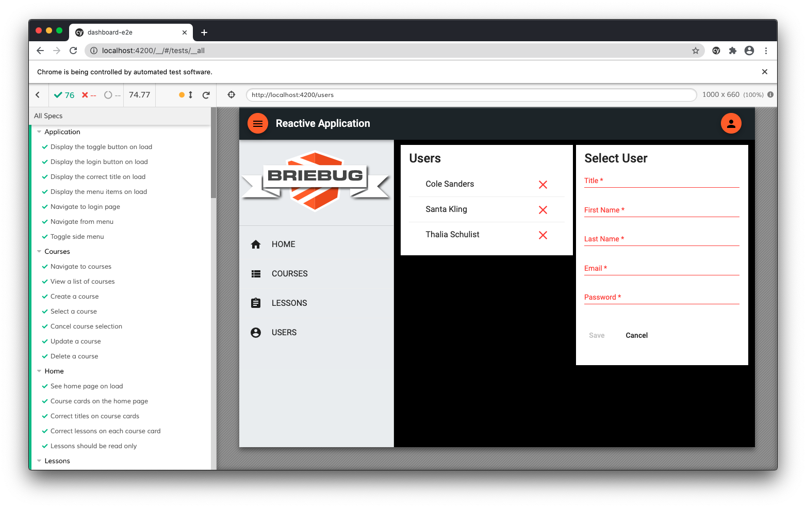

# Cypress Testing Quickstart



This is the sample project for the Cypress Testing Quickstart course from BrieBug Academy. 

The sample project includes an Angular web application and a mock RESTful API  within an Nx workspace by NRWL. The Angular application uses state and data libs to manage state and handle server communication. The state lib is built around NgRx and the application is entirely reactive. 

## Prerequisites
- [Git](https://git-scm.com/book/en/v2/Getting-Started-Installing-Git)
- Node.js and NPM – we recommend using [NVM (Linux/Mac)](https://github.com/creationix/nvm) or [NVM-Windows (Windows)](https://github.com/coreybutler/nvm-windows)
- Install Angular CLI via `npm i -g @angular/cli`
- Install Ionic CLI va `npm i -g @ionic/cli`

## Web: Getting Started

```
git clone https://github.com/briebug/bba-cypress-quickstart.git
cd bba-cypress-quickstart
npm i
npm run serve:all
```

The `serve:all` command is a convenience methods that runs the `serve:auth` and `serve:web` commands concurrently. You can run each command separately if you need to. If you want to run the application without authentication, use the `serve:api` in place of `serve:auth`.

```
"serve:auth": "node server/server.js",
"serve:api": "json-server server/db.json",
"serve:web": "ng serve --open",
"serve:all": "concurrently \"npm run serve:auth\" \"npm run serve:web\""
```

The web application will open to [http://localhost:4200](http://localhost:4200) in your browser.

You can see the API by navigating to [http://localhost:3000](http://localhost:3000) in your browser.

> Note: the above terminal commands are for Mac. Remember to substitute the appropriate commands for your OS.

## Web: Running E2E

Because Cypress ships with Nx, E2E tests can be run with the command below.

```
npm run e2e
```

Or even better, run this command.

```
nx run dashboard-e2e:e2e --watch
```
